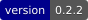
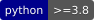
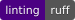
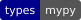
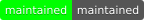
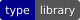
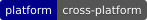
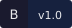
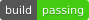

---

## Why BadgeShield?

BadgeShield gives you pixel-perfect SVG badges — rectangular, pill, circle, framed, or banner — with accurate text sizing powered by real font metrics. Drop it into a CI pipeline, a Python script, or call it from the terminal.

<div class="feature-grid" markdown>

<div class="feature-item reveal" data-delay="1" markdown>
<span class="feature-icon">🎨</span>
**5 Templates**

Choose `DEFAULT` (two-part rectangular), `PILL` (fully rounded), `CIRCLE`, `CIRCLE_FRAME` with 11 PNG overlays, or `BANNER` (icon-zone + text).
</div>

<div class="feature-item reveal" data-delay="2" markdown>
<span class="feature-icon">✨</span>
**4 Visual Styles**

Apply `FLAT`, `ROUNDED`, `GRADIENT`, or `SHADOWED` to any template via `--style` or the `BadgeStyle` enum.
</div>

<div class="feature-item reveal" data-delay="3" markdown>
<span class="feature-icon">🌈</span>
**51 Built-in Colors**

Use `BadgeColor` enum names like `GREEN` or `DARK_PURPLE`, or supply any `#RRGGBB` hex value.
</div>

<div class="feature-item reveal" data-delay="4" markdown>
<span class="feature-icon">📐</span>
**Accurate Text Sizing**

Text widths are measured with Pillow font metrics (DejaVuSans), not guesswork — badges always fit.
</div>

<div class="feature-item reveal" data-delay="5" markdown>
<span class="feature-icon">🖼️</span>
**Logo Support**

Embed any PNG/JPEG logo with optional color tinting to match your brand palette.
</div>

<div class="feature-item reveal" data-delay="6" markdown>
<span class="feature-icon">⚡</span>
**Concurrent Batch**

Generate hundreds of badges in parallel from a single JSON config using `BadgeBatchGenerator`.
</div>

<div class="feature-item reveal" data-delay="7" markdown>
<span class="feature-icon">🖥️</span>
**Modern CLI**

Typer-powered CLI with Rich progress bars, error panels, summary table, and an `audit` subcommand that detects external URL violations in SVG output.
</div>

</div>

---

## Why badgeshield instead of shields.io?

shields.io is great — but it makes an HTTP call to an external server on every CI run. **badgeshield generates badges entirely offline:**

- **No network calls** — works in air-gapped CI, behind corporate proxies, and offline laptops
- **No rate limits** — generate thousands of badges in a single run
- **No data sent externally** — version numbers, branch names, and repo stats stay local
- **Reproducible** — same inputs always produce the same SVG, no caching surprises

```bash
# Generate every standard badge for your Python project in one command
badgeshield preset --all --output-path ./badges/ --format markdown
```

---

## Badge Showcase

These badges are generated by badgeshield itself — no shields.io, no network calls.

=== "Project badges"

    | Badge | Command |
    |---|---|
    |  | `badgeshield preset version` |
    |  | `badgeshield preset python` |
    |  | `badgeshield preset ruff` |
    |  | `badgeshield preset mypy` |
    |  | `badgeshield preset maintained` |
    |  | `badgeshield preset library` |
    |  | `badgeshield preset cross-platform` |

=== "Templates"

    | Template | Preview |
    |---|---|
    | `DEFAULT` |  |
    | `PILL` |  |
    | `CIRCLE` |  |
    | `BANNER` |  |

=== "Styles"

    | Style | Preview |
    |---|---|
    | `FLAT` |  |
    | `ROUNDED` |  |
    | `GRADIENT` |  |
    | `SHADOWED` |  |

---

## Quick Look

=== "Python API"

    ```python
    from badgeshield import BadgeGenerator, BadgeTemplate, BadgeStyle

    generator = BadgeGenerator(template=BadgeTemplate.DEFAULT, style=BadgeStyle.GRADIENT)
    generator.generate_badge(
        left_text="build",
        left_color="DARK_GREEN",
        right_text="passing",
        right_color="#44cc11",
        badge_name="build.svg",
    )
    ```

=== "CLI — single"

    ```bash
    badgeshield single \
      --left-text "coverage" \
      --left-color "#555555" \
      --right-text "94%" \
      --right-color "#44cc11" \
      --style gradient \
      --badge-name coverage.svg \
      --output-path ./badges
    ```

=== "CLI — batch"

    ```bash
    badgeshield batch badges.json --output-path ./badges --style rounded
    ```

    `badges.json`:
    ```json
    [
      { "badge_name": "build.svg",    "left_text": "build",    "left_color": "GREEN" },
      { "badge_name": "coverage.svg", "left_text": "coverage", "left_color": "#555", "right_text": "94%", "right_color": "#44cc11", "style": "gradient" }
    ]
    ```

=== "CLI — audit"

    ```bash
    badgeshield audit build.svg        # exits 0 if clean
    badgeshield audit build.svg --json # machine-readable JSON
    ```

---

📖 Continue to [Installation](installation.md) or jump to the [Python API guide](getting-started/usage/).
